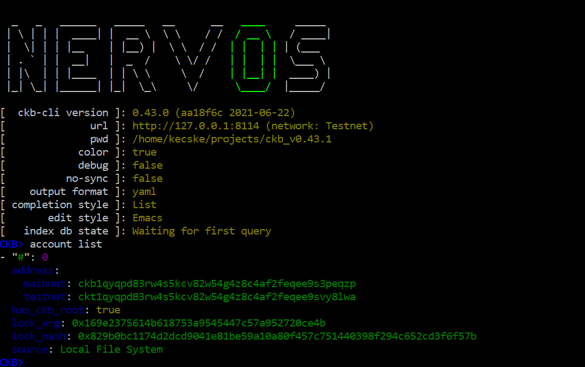
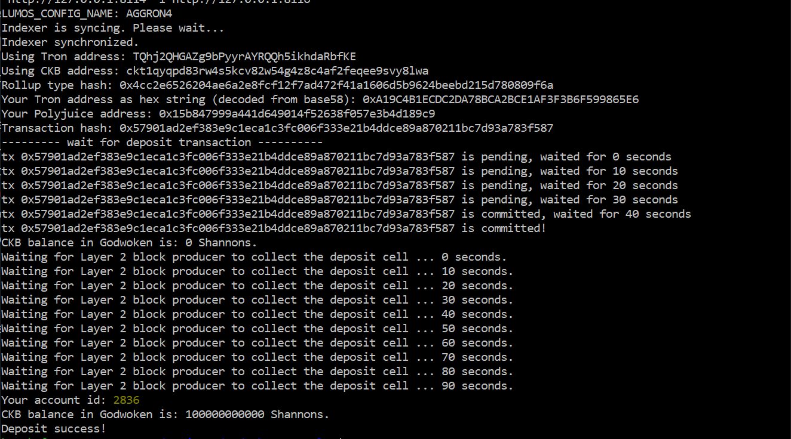
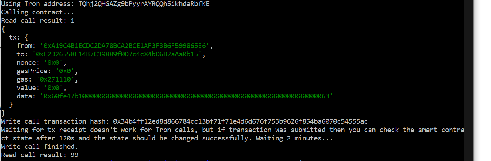

1)  

2)  https://explorer.nervos.org/aggron/address/ckt1qyqpd83rw4s5kcv82w54g4z8c4af2feqee9svy8lwa

3)  

4)  

5)  Write call transaction hash: 0x34b4ff12ed8d866784cc13bf71f71e4d6d676f753b9626f854ba6070c54555ac

6)  Deployed contract address: 0xE2D26558F14B7C39889f0D7c4c84bD6B2aAa0b15

7)  abi: [
    {
      "inputs": [],
      "stateMutability": "payable",
      "type": "constructor"
    },
    {
      "inputs": [
        {
          "internalType": "uint256",
          "name": "x",
          "type": "uint256"
        }
      ],
      "name": "set",
      "outputs": [],
      "stateMutability": "payable",
      "type": "function"
    },
    {
      "inputs": [],
      "name": "get",
      "outputs": [
        {
          "internalType": "uint256",
          "name": "",
          "type": "uint256"
        }
      ],
      "stateMutability": "view",
      "type": "function"
    }
]

8)  tron address: TQhj2QHGAZg9bPyyrAYRQQh5ikhdaRbfKE